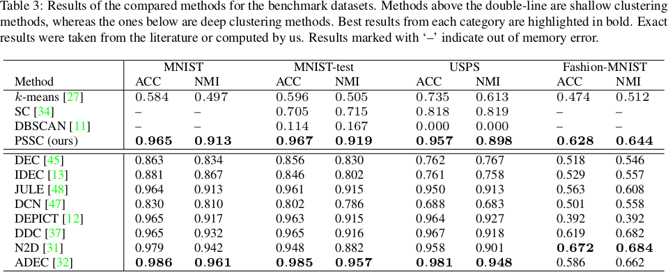

# Scattering-Based Image Clustering using POC


This respository contains the main codebase for the paper: *Scattering Transform Based Image Clustering using Projection onto Orthogonal Complement*.

This respository allows to reproduce the experiments from the paper. Furthermore, we include Jupyter Notebooks illustrating step-by-step out PSSC clustering framework as well as the POC projection step.

## Contents

 * [1. Getting Started](#getting-started)
 * [2. Directory Structure](#directory-structure)
 * [3. Quick Guide](#quick-guide)
 * [4. Contact](#contact)


## Getting Started

To download the code, fork the repository or clone it using the following command:

```
  git clone https://github.com/SomeRandomUserAccount/ScatClustering.git
```

### Prerequisites

To get the repository running, you will need several python packages, e.g., numpy, kymation, pytorch or matplotlib.

You can install them all easily and avoiding dependency issues by installing the conda environment file included in the repository. To do so, run the following command from the Conda Command Window:

```shell
$ conda env create -f environment.yml
$ conda activate scat_clustering
```

The specific requirements are listed in [this file](https://github.com/SomeRandomUserAccount/ScatClustering/blob/submission_6225/environment.yml)

*__Note__:* This step might take a few minutes


## Directory Structure

The following tree diagram displays the detailed directory structure of the project. Some directory names and paths can be modified in the [CONFIG File](https://github.com/SomeRandomUserAccount/ScatClustering/blob/submission_6225/src/CONFIG.py).

```
ScatClustering
|
├── resources/
|
├── src/
│   |── lib/
|   |    ├── clustering/
|   |    |   ├── uspec.py
|   |    |   └── utils.py
|   |    ├── data/  
|   |    |   ├── data_loaders.py
|   |    |   ├── data_processing.py
|   |    |   ├── ...
|   |    └── ...
|   |
|   |── notebooks/
|   |    ├── scat_clustering.ipynb
|   |    └── scat_geometry.ipynb
|   |
│   ├── scattering_clustering.py
│   ├── scattering_geometry.py
│   └── extract_results.py
|
├── environment.yml
└── README.md
```

Now, we give a short overview of the different files and directories:

- **resources/**: Images from the README.md file

- **src/**: Code for to reproduce the results from the paper.

  - **lib/**: Library methods for different purposes, such as command-line arguments handling, implementation of USPEC clustering or POC projection algorithm.

  - **notebooks/**: Jupyter notebooks illustrating the the PSSC clustering frameworks (*scat_clustering.ipynb*) as well as the geometry of the scattering transform of small images (*scat_geometry.ipynb*).

  - **scattering_clustering.py**: Script used to reproduce the results from the paper.

  - **scattering_geometry.py**: Script used to evaluate the spectral distribution of the data matrices in the image and scattering transform domains. It also computes the principal angles.

- **environment.yml**: Conda environment file containing the necessary requirements to run the code.


## Quick Guide

In this section, we explain how to use the repository to reproduce the experiments from the paper.



### Clustering Results

The PSSC clustering results above listed in the table (Section 5.1 from the paper) can be reproduced using the  **scattering_clustering.py** script. This method takes the following parameters:

```shell
$ python scattering_clustering.py [-h] [--dataset_name DATASET_NAME]
                                [--verbose VERBOSE]
                                [--random_seed RANDOM_SEED] [--fname FNAME]
                                [--scattering SCATTERING]
                                [--batch_size BATCH_SIZE]
                                [--valid_size VALID_SIZE]
                                [--equalize EQUALIZE]
                                [--pca PCA]
                                [--pca_dims PCA_DIMS]
                                [--J J]
                                [--max_order MAX_ORDER]
                                [--L L]
                                [--shape SHAPE]
                                [--uspec USPEC]
                                [--num_candidates NUM_CANDIDATES]
                                [--num_reps NUM_REPS]
                                [--num_clusters NUM_CLUSTERS]
                                [--poc_preprocessing POC_PREPROCESSING]
                                [--num_dims NUM_DIMS]
```  

For a detailed description of these parameters, type ```python scattering_clustering.py  --help```. Default values are listed (and can be modified) in [CONFIG.py](https://github.com/SomeRandomUserAccount/ScatClustering/blob/submission_6225/src/CONFIG.py)

**Example**: To reproduce the listed results for the MNIST dataset, run the following command:


```shell
$ python scattering_clustering.py --dataset_name mnist --verbose 1 \
                                  --pca True  --pca_dims 1000 \
                                  --batch_size 256
```

### Ablation Studies

In this section we explain how to reproduce the results from the ablation study from the paper (Section 5.3). The goal of this study is to further understand the contribution that each building block of the PSSC clustering framework has towards the overall clustering performance.

<!-- Ablation Study figure. We use HTML syntax to center the image, control width and add top- and bottom-padding.-->
<p align="center" style="padding-top: 15px; padding-bottom:10px">
  
</p>

The relevant building blocks for the ablation study (i.e., ScatNet, POC projection step and clustering algorithm) can be modified using the following command line arguments:

 - ```--scattering```: This boolean parameter toggles applying the scattering transform to the images.

 - ```--poc_preprocessing```: If 'True', the POC projection step is applied prior to the clustering algorithm.

 - ```--uspec```: If 'True', the U-SPEC algorithm is used to cluster the feature vectors. Otherwise, we use the k-means algorithm.

**Example 1**: The following reproduces the row (2) from the ablation study:

```shell
$ python scattering_clustering.py --dataset_name mnist --verbose 1 \
                                  --scattering False --batch_size 256
```

**Example 2**: The following reproduces the row (6) from the ablation study:

```shell
$ python scattering_clustering.py --dataset_name mnist --verbose 1 \
                                  --pca True  --pca_dims 1000 \
                                  --poc_preprocessing False --uspec False \
                                  --batch_size 256
```

<!--  -->
